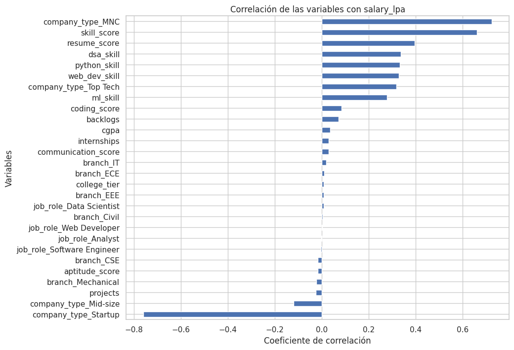
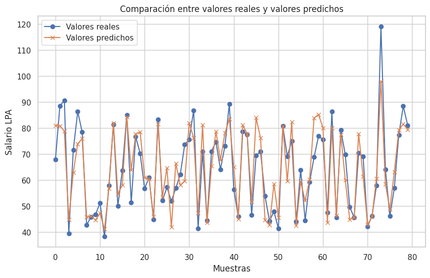
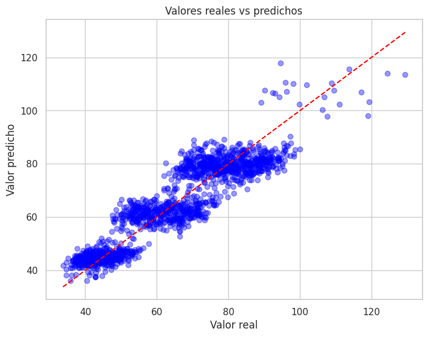
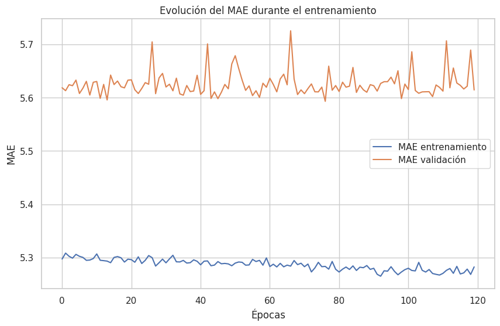

# Machine Learning - Predicción de Salario

Proyecto de Machine Learning para predecir el salario anual de estudiantes recién egresados utilizando el dataset **Student Placement & Salary**. El salario se encuentra expresado en **LPA** (*Lakhs Per Annum*), donde 1 LPA equivale a $18,100 pesos anuales.

El objetivo principal es desarrollar un modelo de regresión capaz de estimar el salario de un estudiante con base en sus características académicas, habilidades técnicas, experiencia y tipo de compañía.

---

## Descripción del proyecto

Este proyecto aplica un flujo completo de Machine Learning, incluyendo:

* Análisis exploratorio de datos.
* Limpieza de valores nulos.
* Eliminación de variables no relevantes.
* Codificación de variables categóricas.
* Normalización de variables numéricas.
* Separación de datos en entrenamiento y prueba.
* Entrenamiento de modelos de regresión.
* Evaluación mediante MAE y R2.
* Graficas para la toma de decisiones

Se implementó un modelo inicial de regresión y posteriormente una red neuronal de regresión utilizando capas densas con activación ReLU. El modelo fue evaluado con métricas de regresión, principalmente el **Error Absoluto Medio (MAE)**.

---

## Dataset

El dataset utilizado fue **Student Placement & Salary**, compuesto por información académica, técnica y laboral de estudiantes.

El conjunto de datos original contiene:

* **9000 registros**
* **20 columnas**
* Variables numéricas y categóricas
* Variable objetivo: `salary_lpa`

La variable `salary_lpa` representa el salario anual del estudiante en LPA.

---

## Variables del dataset

| Variable              | Tipo                       | Descripción                                                                                                                                        |
| --------------------- | -------------------------- | -------------------------------------------------------------------------------------------------------------------------------------------------- |
| `student_id`          | Categórica / Identificador | Identificador único de cada estudiante. Fue eliminada porque no aporta información predictiva.                                                     |
| `cgpa`                | Numérica                   | Promedio académico del estudiante. Se utilizó como variable predictora.                                                                            |
| `branch`              | Categórica                 | Rama o especialidad de ingeniería del estudiante. Fue eliminada debido a su baja relación con el salario.                                          |
| `college_tier`        | Numérica / Ordinal         | Nivel o categoría de la universidad del estudiante. Puede influir en oportunidades laborales.                                                      |
| `python_skill`        | Numérica                   | Nivel de habilidad en Python. Representa competencias técnicas.                                                                                    |
| `dsa_skill`           | Numérica                   | Nivel de habilidad en estructuras de datos y algoritmos.                                                                                           |
| `ml_skill`            | Numérica                   | Nivel de habilidad en Machine Learning.                                                                                                            |
| `web_dev_skill`       | Numérica                   | Nivel de habilidad en desarrollo web.                                                                                                              |
| `coding_score`        | Numérica                   | Puntaje general de programación del estudiante. Fue normalizada.                                                                                   |
| `communication_score` | Numérica                   | Puntaje de habilidades de comunicación. Fue normalizada.                                                                                           |
| `aptitude_score`      | Numérica                   | Puntaje de aptitud lógica o razonamiento. Fue normalizada.                                                                                         |
| `internships`         | Numérica                   | Número de prácticas profesionales realizadas por el estudiante.                                                                                    |
| `projects`            | Numérica                   | Número de proyectos realizados. Fue normalizada.                                                                                                   |
| `backlogs`            | Numérica                   | Número de materias reprobadas o pendientes. Fue normalizada.                                                                                       |
| `resume_score`        | Numérica                   | Puntaje del currículum del estudiante. Fue normalizada.                                                                                            |
| `skill_score`         | Numérica                   | Puntaje global de habilidades.                                                                                                                     |
| `placed`              | Numérica / Binaria         | Indica si el estudiante fue colocado laboralmente. Fue eliminada porque después de limpiar los datos todos los registros restantes tenían valor 1. |
| `company_type`        | Categórica                 | Tipo de compañía donde fue colocado el estudiante. Se conservó y se transformó mediante One Hot Encoding.                                          |
| `job_role`            | Categórica                 | Rol laboral del estudiante. Fue eliminada debido a su baja relación con el salario.                                                                |
| `salary_lpa`          | Numérica                   | Variable objetivo. Representa el salario anual en LPA.                                                                                             |

---

## Preprocesamiento de datos

Durante la etapa de preprocesamiento se identificó que el dataset contenía aproximadamente **1.4% de celdas vacías**. Estos valores faltantes correspondían principalmente a estudiantes que no fueron colocados laboralmente, es decir, registros donde la variable `placed` tenía valor 0.

Debido a que el objetivo del modelo es predecir el salario de estudiantes colocados, se eliminaron las filas con valores faltantes.

También se eliminaron las siguientes columnas:

| Columna eliminada | Motivo                                                                           |
| ----------------- | -------------------------------------------------------------------------------- |
| `student_id`      | Es un identificador único y no aporta información para la predicción.            |
| `placed`          | Después de eliminar valores nulos, todos los registros restantes tenían valor 1. |
| `branch`          | No mostró una relación significativa con `salary_lpa`.                           |
| `job_role`        | No mostró una relación significativa con `salary_lpa`.                           |

La variable `company_type` fue conservada porque presentó una relación importante con el salario. Esta variable fue transformada mediante **One Hot Encoding** para convertir sus categorías en columnas binarias.

---

## Normalización

Las variables numéricas fueron normalizadas utilizando **StandardScaler**, con el objetivo de transformar los valores para que tuvieran una media cercana a 0 y una desviación estándar cercana a 1.

Esto ayuda a evitar que variables con escalas más grandes tengan mayor influencia durante el entrenamiento del modelo.

Variables normalizadas:

* `cgpa`
* `coding_score`
* `communication_score`
* `aptitude_score`
* `projects`
* `resume_score`
* `backlogs`

---

## División de datos

El dataset fue dividido en dos subconjuntos:

| Conjunto      | Porcentaje | Uso                                        |
| ------------- | ---------: | ------------------------------------------ |
| Entrenamiento |        80% | Entrenar el modelo                         |
| Prueba        |        20% | Evaluar el rendimiento con datos no vistos |

---

## Modelos implementados

### Modelo inicial

Se implementó un modelo de regresión como base para predecir el salario anual de los estudiantes a partir de sus características académicas, técnicas y laborales.

### Red neuronal de regresión

Posteriormente, se implementó una red neuronal utilizando capas densas.

La arquitectura general del modelo incluyó:

* Capas densas ocultas.
* Función de activación ReLU.
* Una capa de salida con una sola neurona.
* Optimizador Adam.
* Función de pérdida MSE.
* Métrica principal MAE.

La función ReLU fue utilizada en las capas ocultas porque permite que la red aprenda relaciones más complejas en las variables predictoras.

La capa de salida tiene una sola neurona porque el problema busca predecir un valor numérico: `salary_lpa`.

---

## Métricas de evaluación

El desempeño del modelo fue evaluado utilizando:

| Métrica | Descripción                                                                                      |
| ------- | ------------------------------------------------------------------------------------------------ |
| MAE     | Error Absoluto Medio. Indica cuánto se equivoca el modelo en promedio.                           |
| R2      | Coeficiente de determinación. Indica qué tan bien el modelo explica la variabilidad del salario. |

El **MAE** fue utilizado como métrica principal porque permite interpretar el error en la misma escala de la variable objetivo.

Por ejemplo, si el modelo obtiene un MAE de 5 LPA, significa que el error promedio es de aproximadamente 5 LPA, equivalente a ₹500,000 anuales.

---

## Resultados

Se generó una tabla comparativa de una muestra de 80 de los valores reales y los valores predichos por el modelo. Esta tabla permite observar el comportamiento individual de las predicciones y el error de cada uno.

También se generó una gráfica de **valores reales vs. valores predichos**. En esta gráfica, la línea diagonal representa la predicción ideal. Mientras más cerca estén los puntos de esta línea, mejor es el desempeño del modelo. 

Además, se analizó la evolución del **MAE durante el entrenamiento**. El MAE de entrenamiento disminuyó conforme avanzaron las épocas, lo cual indica que el modelo aprendió de los datos de entrenamiento. Sin embargo, el MAE de validación se mantuvo más alto y no mostró una disminución clara, lo que indica que existe un **overfitting**.

---

## Conclusión

El modelo logró identificar una tendencia entre las características de los estudiantes y el salario anual estimado. Sin embargo, los resultados también muestran que existe diferencia entre el desempeño en entrenamiento y validación, lo cual indica que el modelo puede mejorar mediante ajuste de hiperparámetros.

---

## Tecnologías utilizadas

* Python
* Pandas
* Matplotlib
* Scikit-learn
* TensorFlow
* Jupyter Notebook

---

## Referencias

Pedregosa, F., Varoquaux, G., Gramfort, A., Michel, V., Thirion, B., Grisel, O., Blondel, M., Prettenhofer, P., Weiss, R., Dubourg, V., Vanderplas, J., Passos, A., Cournapeau, D., Brucher, M., Perrot, M., & Duchesnay, E. (2011). Scikit-learn: Machine learning in Python. *Journal of Machine Learning Research, 12*, 2825–2830.

TensorFlow. (2024). *El modelo secuencial*. TensorFlow. https://www.tensorflow.org/guide/keras/sequential_model?hl=es-419

Matplotlib Development Team. (2026). *Multiple lines using pyplot*. Matplotlib 3.10.9 documentation. https://matplotlib.org/stable/gallery/pyplots/pyplot_three.html

Matplotlib Development Team. (2026). *scatter(x, y)*. Matplotlib 3.10.9 documentation. https://matplotlib.org/stable/plot_types/basic/scatter_plot.html
